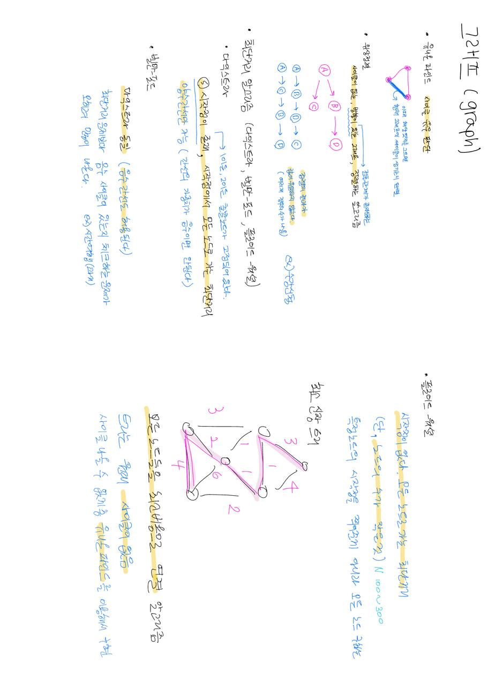

# 그래프
- node 노드 (정점)
- edge 엣지 (간선)
- 인접 정점 : 하나의 정점에서 간선에 의해 직접 연결되어 있는 정점
- 차수 : 정점에 연결된 간선의 수
  - 무방향 그래프 : 하나의 간선이 2개의 정점에 인접하기 때문에 간선의 수에 2배를 한다.
  - 방향 그래프 : 외부에서 들어오는 간선의 수를 `진입 차수`, 외부로 향하는 간선의 수를 `진출차수`라고 한다.

# 그래프 종류
- 무방향 그래프 : 간선의 방향이 없으며, 양방향으로 이동 가능.
- 방향 그래프 : 두 정점을 연결하는 간선의 방향이 존재하며, 간선의 방향으로만 이동할 수 있다.
- 가중치 그래프 : 간선의 비용 또는 가중치가 할당된 그래프이며, 네트워크라고 불르기도 한다.
- 완전 그래프 : 모든 정점간에 간선이 존재하는 그래프이다. 

# 그래프 알고리즘 종류

# 유니온 파인드 : 싸이클 유무 판단

# 위상정렬 : 싸이클 x, 방향간선 o, 노드를 정렬해주는 알고리즘
- `정렬 결과가 꼭 1개가 아니다.`
- ex) 수강신청, 게임빌드오더
- 전후 관계가 있어야 한다. (== 그래프에서 방향이 있다)
- 그래프의 노드들을 선형으로 나열하기 때문에 값이 유일하지 않다는 특징

# 최단거리 알고리즘
## 1 다익스트라 : 시작점 있고, 음수간선 x (양수간선 o)
- 시작점에서 다른 모든 노드로 가는 최단거리 구하는 알고리즘
- 양수 간선만 사용 가능. (단, 간선의 가중차가 음수면 안됨)

## 2 벨만포드 : 시작점 있고, 음수간선 o
- 다익스트라와 동일함
- 다익스트라와 다른 점은 음수의 간선도 허용
- 실제로는 최단거리보다 음수 사이클이 있는 지를 체크하는 문제가 많이 나옴.
- ex) 시간여행, 웜홀 ()

## 3 플로이드 워셜 : 시작점 없고, 모든 노드 쌍의 최단거리 구하기
- 시작점이 없다. 
- 주어진 모든 노드에 대해 최단거리를 구한다. 
- 시간복잡도 안좋음. 
- 노드 수N가 적게 주어질 때 접근 ex)100~200 

## 최소 신장 트리 : 그래프에서 최소의 가중치 합으로 모든 노드를 연결하는 알고리즘
- 모든 노드를 간선의 가중치가 최소비용으로 연결
- 싸이클 있으면 안된다. 
- 그러므로 싸이클을 판별해주는 유니온 파인드를 구현해서 사용해야한다.
