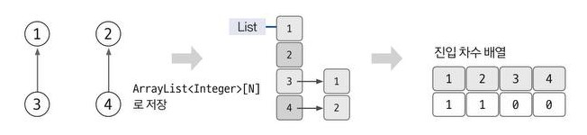
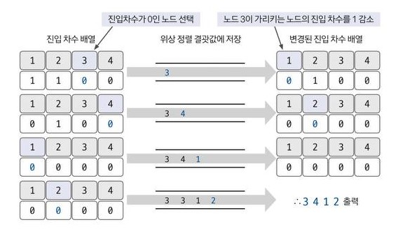

# 위상 정렬(Topological Sort) 알고리즘 

<br>

```
각 정점들이 가지는 위상에 따라서 그래프를 구성하는 정점들을 순서대로 정렬해서 결과값을 출력하는 알고리즘
```

<br>

## 접근방법
- 비순환 방향 그래프에서 정점을 선형으로 정렬
- 비순환 방향 그래프이기 때문에 사이클이 존재하면 안됨
- 주로 선후 관계가 있는 일련의 작업을 차례대로 수행하기 위해 사용
- 선후 관계로 전체적인 순서를 정렬해야함

<br>

## 알아야할 점
- 위상 : 어떤 사물이 다른 사물과의 관계 속에서 가지는 위치나 상태
- 차수 : 노드와 연결되어 있는 간선의 개수
- 진입차수 : 해당 노드로 들어오는 간선의 개수

<br>

## 구현순서
### 1. 인접리스트에 노드 데이터 저장하고, 진입 차수 배열 값을 업데이트 합니다.

- 1-1. 주어진 노드의 수만큼 인접 리스트 초기화하기.
- 1-2. 진입 차수 배열 초기화하기.
- 1-3. 비교 횟수 만큼 인접 리스트 데이터 저장하기.
- 1-4. 진입 차수 배열 초기 데이터 저장하기.
    
```java
Scanner sc = new Scanner(System.in);
int n = sc.nextInt(); // 노드 수
int m = sc.nextInt(); // 비교 횟수
        
ArrayList<ArrayList<Integer>> arr = new ArrayList<>();
for(int i = 0; i < n; i++) {
    arr.add(new ArrayList<>()); // 1-1.
}
int[] indegree = new int[n]; // 1-2.
for(int i = 0; i < m; i++) {
    int S = sc.nextInt(); // 정렬해야하는 노드 
    int E = sc.nextInt(); // S 노드가 가르키는 노드 
    arr.get(S).add(E); // 1-3.
    indegree[aIdx]++; // 1-4.
}
```

### 2. 위상 정렬 수행 과정

- 2-1. 진입 차수가 0인 노드를 큐에 저장한다.
- 2-2. 큐에서 데이터를 poll해 해당 노드를 탐색 결과에 추가하고, 해당 노드가 가르키는 노드의 진입 차수를 1씩 감소한다.
- 2-3. 감소했을 때 진입 차수가 0이 되는 노드를 큐에 offer한다.
- 2-4. 큐가 빌 때까지 1~3번을 반복한다.

```java
Queue<Integer> q = new LinkedList<>();
ArrayList<Integer> result = new ArrayList<>();
for (int i = 0; i < n; i++) {
    if (indegree[i] == 0) { // 2-1.
        q.offer(i); 
    }
}
while (!q.isEmpty()) { // 2-4.
    int cur = q.poll(); // 2-2.
    for (Integer nextSub : arr.get(cur)) { // 2-2.
        if (indegree[nextSub] !=0 ) indegree[nextSub]--; // 2-2.
        if (indegree[nextSub] == 0) q.offer(nextSub); // 2-3.
    }
    result.add(cur);
}
```

<br>

## 시간복잡도
- O(V+E)
- V : 노드 수, E : 에지 수

<br>

## 관련문제

- [그래프 최단거리 - 교육과정](https://github.com/yungenie/algorithm/blob/eedf1af4ba10770f1a1ff9bd09c6a81d7fc1586c/src/study/inflearn/lecture02/section08/Ex08_06_03.java)
- [그래프 최단거리 - 교육과정 풀이](https://github.com/yungenie/algorithm/blob/eedf1af4ba10770f1a1ff9bd09c6a81d7fc1586c/src/study/inflearn/lecture02/img/ex08_06_Answer.png)
