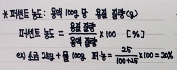
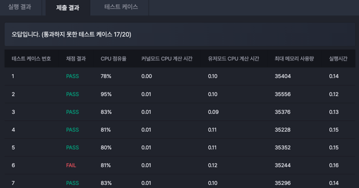

# 문제
[구름 - 소금물 농도 구하기 (레벨1)](https://level.goorm.io/exam/194193/%EC%86%8C%EA%B8%88%EB%AC%BC%EC%9D%98-%EB%86%8D%EB%8F%84-%EA%B5%AC%ED%95%98%EA%B8%B0/quiz/1)

# 나의 문제 풀이
못 품.
소금물 농도 구하는 공식 잊음.
TC에서 소수 2번째 자리까지 출력하는 부분에서 걸렸음.

# 느낀점
### 소금물의 농도 구하는 공식



### 소수 2번째 자리까지 출력 

- 오답
```java
public class 구현02_소금물_농도 {
    public static void main(String[] args) throws Exception {
        // ~~ 생략 ~~~

        // 기존 소금의 양 (Ng의 7% 소금물)
        double salt = N * 0.07;

        // 최종 소금물의 양
        double total = N + M;

        // 최종 소금물의 농도 (전체 소금물에서 소금이 차지하는 비율)
        double concentration = (salt / total) * 100;

        // 소수점 둘째 짜리 버림
        System.out.printf("%.2f", concentration);
    }
}
```

테스트 케이스에서 걸렸다. 이유를 도무지 잘 몰랐다가 검색을 해보니 
오류가 발생하는 이유가 System.out.printf("%.2f", concentration);는 소수점 셋째 자리에서 반올림을 해서 오류가 발생했다.
문제에서 요구하는 소수점 둘째 자리까지만 표현하고 나머지는 버림 처리가 되지 않기 때문에 테스트 케이스에서 오류가 발생했다. 

- 문제 해결


1. Math.floor나 실수 연산 활용

```java
public class 구현02_소금물_농도 {
    public static void main(String[] args) throws Exception {
        // ~~ 생략 ~~~

        // 기존 소금의 양 (Ng의 7% 소금물)
        double salt = N * 0.07;

        // 최종 소금물의 양
        double total = N + M;

        // 최종 소금물의 농도 (전체 소금물에서 소금이 차지하는 비율)
        double concentration = (salt / total) * 100;
        
        System.out.printf("%.2f", Math.floor(concentration * 100) / 100.0);
    }
}
```
1. concentration * 100 : 소수점 둘째 자리까지 남기기 위해 배수 연산 처리 
2. Math.floor(concentration * 100) : 사용해 소수점 이하 버림. 반환값은 실수이므로 결과.0 
3. Math.floor(concentration * 100) / 100.0 : 다시 소수점 자리 복원 
4. System.out.printf("%.2f", Math.floor(concentration * 100) / 100.0); : 소수 셋째자리에서 반올림하고 두번째 자리까지 표현하지만, 셋째자리가 없기 때문에 결과에 충족함.
- ex) 12.789234 -> 1278.9234 (1) -> 1278.0 (2) -> 12.78 (3) -> 12.78 (4) 

```
+ 추가
System.out.println(Math.floor(concentration * 100) / 100.0) 로 해도 테스트 케이스 결과에 걸리는 거 보니
계산의 결과가 딱 둘째 자리로 떨어지지 않고 1.56000000000001처럼 나올 수도 있고, 오차가 발생하나 봄
```

2. BigDecimal을 사용해서 소수점 둘째 자리까지 버림 처리
```java
import java.math.BigDecimal;
import java.math.RoundingMode;

public class 구현02_소금물_농도 {
    public static void main(String[] args) throws Exception {
        // ~~ 생략 ~~~

        // 기존 소금의 양 (Ng의 7% 소금물)
        double salt = N * 0.07;

        // 최종 소금물의 양
        double total = N + M;

        // 최종 소금물의 농도 (전체 소금물에서 소금이 차지하는 비율)
        double concentration = (salt / total) * 100;

        // 소수점 둘째 짜리 버림
        BigDecimal result = new BigDecimal(concentration).setScale(2, RoundingMode.FLOOR);
        
        System.out.println(result);
    }
}
```
- BigDecimal은 소수점 이하 자리수를 제어할때 정확한 처리를 지원 해줌. 기본형으로 계산했을떄 발생할 수 있는 부정확한 소수점, 유실 등의 문제를 해결할 수 있음.
- 다양한 반올림 모드가 있음. RoundingMode를 통해 버림(FLOOR)모드를 사용해 정확히 소수점 둘째 자리까지만 남기고 나머지 버리도록 처리함.
- BigDecimal로 처리하는 이유? double와 float 타입을 저장할때 컴퓨터는 이진수의 근사치를 저장하고, 그 수를 다시 십진수로 표현하면서 문제가 발생하여 BigDeimal API 사용해서 문제를 해결할 수 있음.
- [블로그) float와 double 문제점, 그리고 BigDecimal](https://velog.io/@boradol/Java-%EC%86%8C%EC%88%98%EC%A0%90-%EA%B3%84%EC%82%B0%EA%B3%BC-BigDecimal)
