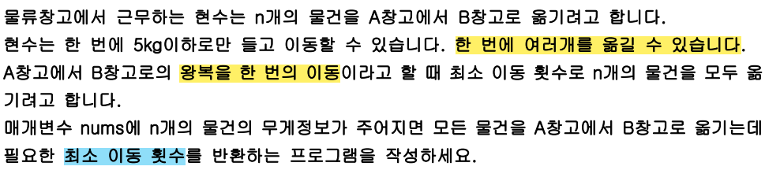

# 인프런 자바 코딩테스트 - it 대기업 유제
- 강의를 듣고 풀면서 새롭게 알게 된 사실이나, 실수한 점, 잘못 생각 했던 점을 기록합니다.

# Ex05_02~Ex06_01
## Ex05_02
문제 요약
- 이동횟수
- 현수는 A창고에 n개 물건을 한 번에 5kg이하로, 여러개를 옮길 수 있습니다. 모든 물건을 A창고에서 B창고로 옮기는데 최소 이동 횟수 반환

문제 분석
    
  1. 한 번에 여러개를 옮길 수 있습니다.
     - 2개 이하로 어떤 작업을 한다. 라고 했을 때 greedy 탐욕법으로 푸는 거라 생각했는데, 문제에서 여러개를 옮길 수 있다는 걸 보고 탐욕법이 아닌가 헷갈렸음.
  2. 왕복을 한 번의 이동
     - 왕복에 대한 것을 고려해야 하는 지 판단이 안됬음.
  3. 최소 이동 횟수
     - 앞에서 헷갈리는 부분들이 정리가 됬음. 최소 이동을 해야하면 결국 무거운 물건을 최대한 많이 들어야 하므로 탐욕법으로 풀어도 되는 구나 판단했음.

강사님 문제 분석
- 제한사항:
1. nums의 길이는 300,000을 넘지 않습니다.
2. 모든 물건의 무게는 2kg이상 5kg이하입니다.

- 데이터가 30만개 넘어간다. 하면 n^2으로 풀면 Time Limit 나겠구나 인지하기.
- ⚠️물건의 무게 범위가 2~5로 정해져있어 어차피 최대 2개 밖에 물건을 들고 갈 수 밖에 없구나. 문제에서는 여러개 라고 했지만, 결국 1개 아니면 2개로 이동할 수 있으니 탐욕법으로 풀어야 한다.

# Ex04_03~Ex05_01
## Ex05_01
문제 포인트 
- 2명 이하, 2개 까지만 무언가를 한다 싶으면 greedy 탐욕법으로 푸는 것을 고려해봐야 한다.

## Ex04_07
강사님 해법
- 모든 회의를 진행하기 위한 최소 회의실을 구하는 문제
- 여기서! '최소'라는 단어에 뭔가 최소값을 구하는 것인가? 착각하면 안된다.
- 동시에 사용하는 회의실의 최대 갯수는 결국 최소한의 준비해야되는 회의실의 갯수를 의미한다. 
- 왜냐면 모든 회의를 진행해야하기 때문에 동시에 진행되는 회의실의 최대값이 최소한의 회의실 개수이다.
- ex) 유치원 반에서 아이들이 좋아하는 모든 과자의 최소 종류를 알려면 결국 아이들이 좋아하는 모든 과자의 종류를 알면 되듯

강사님 코드 해설
- 회의의 시작시간과 끝나는 시간을 분리해서 리스트에 각각 넣고 시간순으로 정렬을 합니다. 
- 특히 같은 시간에 회의가 시작하고, 끝나고를 동시에 한다면 회의가 끝나는 시간이 먼저, 회의가 시작하는 시간이 나중에 오도록 정렬합니다.

문제 포인트
- n제한이 30만인 경우 시간복잡도 O(n) or O(nlogn) 되도록 생각해야함.
- 모든 회의 진행
- 진행하기 위한 최소 회의실 개수 => 동시에 진행되는 최대 회의 개수
- 회의가 시작하고 끝나고 동시에 일어날 때, 끝나는 시간이 먼저 회의가 시작하는 시간이 나중에 정렬되도록 한다. 

## Ex04_06
풀이설명
- 정전 되기 전까지 tasks 배열을 반복해서 작업을 시키기(-1) 및 1초 증가, 해당 작업번호 기억해두기
- 완료된 작업은 건너뛰기 
- 정전됬을 때 마지막 작업번호 반납하기
- 작업번호를 기억하는 방법은 처리할 작업이 있을 때 배열의 인덱스, 작업이 없으면 -1 담기 

## Ex04_05
studentLoc.forEach((i) -> System.out.print(Arrays.toString(i)));
- 컬렉션 프레임워크는 함수형 인터페이스를 디폴트 메서드로 추가되었습니다.
- 그 중 Iterable 인터페이스의 forEach(Consumer<T> action) 모든 요소에 작업 action을 수행
- Consumer는 소비자로 매개변수만 있고, 반환값이 없음. (출력에 쓰인다)

강사님 해법
- 행열을 직선상의 거리로 바라보기
- 두 지점의 차이가 최소 이동거리를 볼 수 있음
- 중간지점은 N/2

## Ex04_04
- 평균점수가 가장 작은 값을 최종점수로 결정하기 떄문에 결국 더해지는 값들이 작으면 됩니다.
- 그래서 심사위원의 점수를 오름차순으로 정렬하고 앞에서부터 순차적으로 1개를 선택해
- 선택한 i번째의 값과 i+(k-1)번째의 값의 차이가 10초과라면 그 다음 i번째 요소를 선택하게 됩니다.
- 10이하라면 그 사이에 있는 요소를 합산해 k개로 나누면 평균이 됩니다. 
- 평균점수가 가장 낮은 최종점수를 바로 구할 수 있습니다.
- i+(k-1)번째는 K개를 고른 효과를 나타냅니다. 
- 인덱스는 0부터 시작하기 때문에 (k-1)를 해주면 K번째까지 선택 한 걸로 할 수 있습니다.

Arrays.sort()
- 정수형 배열의 오름차순은 기본형 int는 된다.
- 내림차순의 경우는 Integer형으로 변환 후 comparator 구현해야 합니다.

## Ex04_03
강사님 해법 듣고 재도전한 문제
- 큰 수부터 차례대로 가져오면 되니깐 내림차순 후, 순차적으로 가져와야겠다. 까지만 생각해냄.
- 어떻게 총합의 최대를 만들어야할 지 떠오르지 않았음. 일일이 다 계산해봐야하나 확률문제인가 고민했음.
- 어차피 내림차순으로 정렬해서 앞에서 2개씩 라운드되므로, 2개의 요소 차이가 많이 나는 값을 k번 더해주면 된다.
- 어차피 현수가 가져온 값 + 차이를 더해주면 원래 가져와야할 값을 뜻하는 것

Arrays.stream(nums).boxed().toArray(Integer[]::new);
- 정수형 배열의 내림차순은 기본형인 int형은 안되고, 클래스 형인 Integer형으로 해야 됨

# Ex03_04~Ex04_2
## Ex03_04
int[][] inList = new int[n][2];
- 2차원 배열 선언에서 행과 열의 의미
- 왜 [2]인지 정확히 몰랐음,

Queue<Object o> q = new LinkedList<>();
- 링크드리스트는 큐 인터페이스의 대표적인 구현체이다.
- (잘못생각) Queue q = new Queue 선언하고 있었음..

## Ex03_05
LinkedList<Object o> ll = new LinkedList<>();
- 연결리스트는 저장순서가 유지되는 자료구조
- (잘못생각) 연결리스트 저장순서 유지 안되는 줄 알았음..

ll.pollFirst()
- 연결리스트 첫번째 요소 꺼내서 반환 가능
- (잘못생각) list기반으로만 생각해서 stack,queue처럼 요소를 꺼내오는 걸 생각못함..

PriorityQueue<Object o> pq = new PriorityQueue<>();
- 우선순위가 높은 것(요소값 작은) 부터 꺼내는 우선순위 큐 구현체
- (잘못생각) 우선순위 큐 구현체 처음 알았음..

while (!taskInfo.isEmpty() || !waitQ.isEmpty())
- 논리연산자 || (OR결합) 피연산자 중 어느 한쪽만 true이면 true를 결과로 얻는다.

## Ex03_06
Arrays.sort(meetings, (a, b) -> a[0] - b[0]);
- (잘못생각) 2차원 배열의 원소들을 어떻게 비교하는 지 몰랐음.. 

TreeSet<Integer> useRoom = new TreeSet<>();
useRoom.pollFirst()
- 중복이 없고, 기본적으로 오름차순으로 정렬해주는 자료구조임.
- TreeSet 은 레드블랙트리 자료구조로 구현되어있어 O(logn)만에 오름차순 정렬됩니다.
- TreeSet의 첫번째 요소(제일 작은 값의 객체)를 반환.

## Ex04_01
Integer.toBinaryString() 
- 이진수 변환 함수

Arrays.sort()
- (잘못생각) Arrays.sort()에는 Comparator 제공이 안되는 줄 알았음.. 
- Arrays.sort()는 내부적으로도 Dual Pivot Quick Sort로 구현되어 있음.
- 시간 복잡도가 O(nlog₂n)를 가지는 다른 정렬 알고리즘과 비교했을 때도 가장 빠르다.
- PriorityQueue 우선순위 큐 생성자에 람다식으로 Comparator.compare() 정렬기준 추가해서 풀었으나,
- PriorityQueue는 힙(완전이진트리)으로 구현되어 있어 시간복잡도 측면으로는 Arrays.sort()가 더 적합

## Ex04_02
선택정렬 알고리즘 활용
- 해당 알고리즘은 O(n^2) 이므로 데이터가 커지면 비효율적임..

HashMap.getOrDefault()
- (잘못생각)정렬문제여서 HashMap 사용할 생각도 못했다..
- 자료구조를 국한되지 않게 생각하기.

