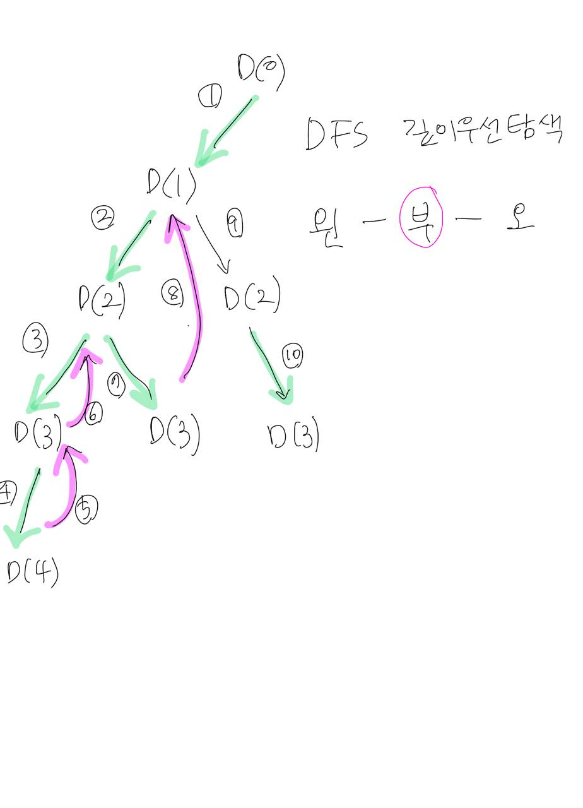

# 인프런 자바 코딩테스트 - it 대기업 유제
- 강의를 듣고 풀면서 새롭게 알게 된 사실이나, 실수한 점, 잘못 생각 했던 점을 기록합니다.

# Ex08_01~Ex08_06

## Ex08_04
### 문제 포인트
- 방향 바꾸기
- 현수(0,0)지점에서 (n-1, m-1)지점까지 방향을 바꾸어야 하는 최소 격자 개수
- 방향을 바꾸는 최소 개수를 구해야하는 문제
- 다익스트라로 해결해야함.
- 우선순위 큐에서 모든 경비를 구하지 않고, cur[] 꺼낼 때 마지막 지점일 경우 return 해주면 조금이라도 시간 복잡도 줄일 수 있다.

### 잘못 생각한 점
- (08_04)격자 밖을 나갈때, 나가지 않을 경우로 나눠서 생각했음.
- (08_04_02) 
  - cost[][] 비용배열 초기화 하지 않았음.
  - return cost[n-1][m-1]로 하지 않고 board[n-1][m-1]로 했음.
  - 다익스트라 시간복잡도 제한 걸기 : cur[2] > cost[cur[0]][cur[1]] continue;
  - 비용 교체 : cost[nx][ny] > cur[2] 작은 값으로 교체 해줘야 함 

## Ex08_03✨
### 문제 포인트
- 벽 허물기
- 현수(0,0)지점에서 (n-1, m-1)지점까지 허물어야 하는 최소 벽 개수
- 다익스트라로 해결해야 함.
- 우선순위 큐에서 모든 경비를 구하지 않고, cur[] 꺼낼 때 마지막 지점일 경우 return 해주면 조금이라도 시간 복잡도 줄일 수 있다.


### 코드 설명
```java
while(!pq.isEmpty()) {
    int[] cur = pq.poll();
    if(cur[2] > cost[cur[0]][cur[1]]) continue; // 1.
    for(int k = 0; k < 4; k++) {
        int nx = cur[0] + dx[k];
        int ny = cur[1] + dy[k];
        if(nx < 0 || nx >= n || ny < 0 || ny >= m) continue;
        if(board[nx][ny] == 0 && cost[nx][ny] > cur[2]) { //2.
            cost[nx][ny] = cur[2];
            pq.offer(new int[]{nx, ny, cur[2]});
        } else if(board[nx][ny] == 1 && cost[nx][ny] > cur[2] + 1){ //3.
            cost[nx][ny] = cur[2] + 1;
            pq.offer(new int[]{nx, ny, cur[2] + 1});
        }
    }
}
```
- 1. 우선순위 큐에서 어떤 정점에서 꺼낸 지점까지 비용이 기존의 비용보다 크다면 굳이 뻗어가는 경우의 수를 볼 필요가 없다. 문제에서는 벽을 부수는 최소 비용을 찾고 있는 거기 때문
- 2. 이동하는 지점의 기존 비용이 커야 이동하려고 하는 비용값을 교체할 수 있다. board 값이 0의 경우 허물지 않기때문에 우선순위 큐에서 꺼낸 값을 교체 해준다.
- 3. 이동하는 지점의 기존 비용이 커야 이동하려고 하는 비용값을 교체할 수 있다. board 값이 1의 경우 허물기때문에 우선순위 큐에서 꺼낸 값 + 1 (허무는 비용)으로 교체 해준다.

### 잘못 생각한 점
- 현수지점에서 도착지점까지 모든 경우의 수를 구해서 그 중에 허무는 벽의 개수 최소값 구하려고 했음. (구현은 못함)
- (강사님 피드백) 4방향 모두 가지 말고 오른쪽, 아래쪽만해도 경우의 수 4^N+N 경우의수 나오므로 Time Limit 나옴.

## Ex08_02
### 문제 포인트
- 최소 환승 경로
- 지하철 최소 환승 경로
- 역번호 : 0~ 1000000 [1000001]의 배열의 크기를 생성해야 하므로 비효율적이므로 인접리스트 보다는 해싱으로 해야한다.
- 최소횟수 : 레벨탐색으로 어떻게 해야겠는데? 아이디어를 떠올리면서 해결하려고 접근해야한다.

### 동작원리


### 잘못 생각한 점

- 인접리스트로는 풀면 해결이 안되겠다. 
- 해싱으로 하되, 환승역을 key로 환승역에 속하는 호선들을 value로 해야겠다.
- ex) {2 : [1,2,3,4,5,6,19], [2,7,8,13], 13 : [2,7,8,13], [13,14,15] ...}
- 한승역 해싱으로 레벨탐색/깊이탐색을 어떻게 해야할 지 접근법이 안떠올랐음.
- 환승지점 찾기, 환승지점에 해당하는 호선(역)들 넣기. 다시 도착역에 해당하는 역 찾기 등
- 복잡한 계산이 많고, 내가 도출하려고 하는 답은 순차적으로 데이터를 추가 해야하는데 Map의 정렬에서 막힘

### 정리
- 방문지점 호선을 체크 해야한다. 
- 역에 해당하는 호선을 해싱 해야한다. ex) 2 : {0,2} 2번역은 0호선/2호선에 포함되어 있다.
- 레벨탐색시 역을 요소로 넣어 값을 꺼낼 때 해싱에서 꺼내서 해당 호선이 체크 되었는 지 확인 후 경우의 수를 탐색하면 된다.

## Ex08_01
### 문제 포인트
- 최소 비행료
- 현수가 사는 도시에서 목적지 도시까지 K번 환승해서 가는 최소비용
- 방향그래프를 인접리스트로 만들기
- 큐로 레벨탐색을 하면서 각 정점의 도착지 정보를 통해 최소비용을 구하는 문제
- 레벨보다 환승값이 커질때 레벨탐색을 멈춰야한다. 

# Ex07_01~Ex07_06
## Ex07_06
### 문제 포인트 
- 숲속의 기사
- 기사를 영희와 동일하게 보기.
- 영희와 기사가 산딸기 지점의 최단 거리를 구해야 한다.
- 영희/기사 지점에서 동서남북 한칸 한칸 움직이며 각 행열마다 좌표의 값은 움직이는 거리(레벨)이다.
- 그러므로 산딸기 지점에 적힌 거리 중 가장 작은 값이 최단거리가 되는 것이다.

## Ex07_05✨
### 문제 포인트
- 집을 짓자
- 모든 빌딩에서 이동거리 합이 최소가 되는 빈땅을 찾아 이동횟수 최소값 구하는 문제
- 1. 2중 for 반복문 돌려 빌딩일때만 빈땅으로 상하좌우로 이동
- 2. 시간복잡도를 줄이기 위해 빈땅일 때만 로직 처리를 합니다. 빈땅을 찾으면 board[nx][ny]-- 감소 시킨다. 
- 3. dist[nx][ny]+= L 모든 빌딩에서 이동거리를 누적하기
- 4. emptyLand 빌딩의 개수만큼 감소 시키기 (빈땅 초기화)


## Ex07_04
### 문제 포인트
- 미로의 최단거리 통로
- 부모레벨 꺼내기 전에 L 레벨을 증가 시켜서, 인접한 4방향 자식레벨을 탐색합니다.
- 이미 방문한 지점은 벽으로 만들고, 레벨을 저장하는 2차원 배열에 체크하여 값 구하기.

## Ex07_03
### 문제 포인트
- 송아지를 잡자
- 현수가 송아지를 잡는 가장 빠른 시간 찾기 (단, 현수와 송아지 둘다 움직인다)
- (07_03_02) 송아지 위치를 먼저 구하고, 스카이 콩콩으로 각각 앞1,뒤-1,앞*2으로 점프했을 떄의 위치(자식레벨)를 탐색하면서 현수 위치와 송아지와 만나면 바로 return 하도록 했습니다.
- 반대로 강사님은 현수의 탐색한 위치를 먼저 구하고, 송아지 위치에 현수가 방문한 지점이였을 경우 답을 반환하도록 함

### 동작원리


- 다른 문제랑 다르게 현수가 이동할 때 송아지도 이동한다.
  - 송아지는 양의 방향으로 계속 이동하기 때문에 L레벨을 초의 흐름으로 봐도 된다. 
  - 해당 레벨의 값(초) 일때는 송아지가 안만났고, 다른 레벨의 같은 값(초)일때 송아지를 만날 수 있다. 
  - 이전 문제처럼 이미 방문했던 지점은 패스하면 안된다.
- 1L: 3 /2L: 9/ 3L: 27/ 4L: 81 / 5L: 243
  - 현수가 콩콩이로 점프한 경우의 수가 레벨을 하나 거치면 똑같은 값이 나옵니다.
  - 상위 레벨에서 나온 값은 그 다음 하위 레벨에 무조건 나타나서 상위 레벨의 경우의 수가 포함되어 있다.
  - 짝수/홀수 행을 구분해서 방문한 지점을 체크하면 된다.

## Ex07_02
### 문제 포인트
- 집으로 이동
- 놀이터에서 집까지 수직선상의 최소 점프 횟수 (단, 웅덩이 지점은 갈 수 없음)
- 넓이우선탐색으로 풀기
- 수직선 범위 내에서 앞/뒤 점프 가능하며, 방문하지 않았던 곳, 부모레벌에서 앞으로 점프 한 곳(뒤쪽으로 두번점프는 안되기 때문에) 제약사항 조건에 맞춰서 구하기

### 동작원리


## Ex07_01
### 문제 포인트
- 타일점프
- 넓이우선탐색문제로 동등레벨탐색을 해야한다.

### 동작원리


### 정리
- BFS 넓이우선탐색은 체크배열을 두어 방문한지점을 기록하여 다음 탐색때 방문한 지점을 탐색하지 않기 위함이 포인트
- 부모레벨에서 자식레벨을 모두 탐색하면서 구하고자 하는 지점(L+1, 찾고자하는 레벨, 찾아낼부모레벨)을 찾아내는 게 포인트 

# Ex06_01~Ex06_06
## Ex06_06
### 문제 포인트
- 알파코드
- 메모이제이션으로 풀어나가야함
- 0의 경우 커트 재귀함수 더 뻗으면 안된다.
- DFS(i) 재귀함수 정의 : 문자열 s의 i번 인덱스부터 문자열을 알파벳으로 복원하는 경우의 수 반환

### 동작원리
- 강사님
  
- 나
  

### 정리 
- 조합의 경우의 수 모두 구하고 Back Tracking 하면서 해당 레벨의 합산 return
- `if(dy[start] > 0) return dy[start];`
  - 그 다음 조합의 경우의 수를 구할 때 메모이제이션으로 이미 구한 경우의 수 return 하여 시간복잡도 줄임
- `if(start < s.length() && s.charAt(start) == '0') return 0;`
  - 0인 경우 알파벳 암호화 번호가 없으므로 아예 재귀 뻗지 말도록 커트 
- `if(start == s.length() -1 || start == s.length()) return 1;`
  - 재귀의 종착점까지 도달했을 때 경우의 수 Back Tracking 하며 리턴

## Ex06_05
### 문제 포인트
- ip 주소 문제
- 주어진 문자열의 순서를 유지하면서 유효한 ip의 경우의 수를 만들어 반환해야합니다.
- 재귀함수를 이용해 완전탐색을 해서 모든 경우의 수를 다 만들어 봐야 한다.
- DFS(i) 재귀함수 정의 : s라는 문자열의 i번 인덱스부터 시작해 0~255 숫자를 만들 수 있는 경우의 수를 찾아내는 함수

### 동작원리

- 재귀함수의 Back Tracking 스택에 쌓인 마지막 요소 하나씩 삭제되면서 그 다음 스택요소 및 로직수행

### 정리
- 체크배열 따로 없음. 
- 주어진 입력 데이터의 순서를 유지하면서 재귀함수로 모든 경우의 수를 다 구해야한다.
- 문자열 하나하나를 파라미터로 넘기지 않고 레벨 파라미터를 넘겨 해당 레벨에서 조합된 숫자를 자료구조에 담아 탈출조건을 짜야한다. 
- `if(s.charAt(start) == '0' && i > start) return;` 05인 경우 재귀함수 커트

## Ex06_04
### 문제 포인트
- 팰린드롬의 경우의 수
- 주어진 문자열 빈도수 해싱 후 Deque 자료구조로 앞뒤 문자열 넣어서 팰린드롬 만들기
- 순서를 유지하지 않고 주어진 문자열 반복해서 재귀
- DFS() 함수 정의 : Deque 자료구조로 앞뒤 문자열 넣고 빈도수 해싱 -2, 재귀 끝나면 문자열 빼고 빈도수 해싱 + 2 하면서 주어진 문자열 길이와 만들어진 팰린드롬의 길이가 같으면 반환

### 동작원리

- 재귀함수의 Back Tracking 잘살펴보기.
- 스택 프레임에서 재귀함수 끝나면 해당 스택에서 pop() 되면 그 이전에 쌓였던 스택으로 이동한다.
- 호출되는 함수마다 스택 프레임에 매개변수/지역변수/복귀주소가 생긴다.

## Ex06_03
### 문제 포인트
- 바둑대회
- 흰돌 능력치, 검은돌 능력치 각각 최상의 팀을 구성하여 흰돌팀과 검은돌팀의 능력차 최소값을 구하는 문제
- DFS 깊이우선탐색 중위탐색법으로 왼-부-오 순서로 탐색된다. 
- 부모레벨을 배열의 인덱스 s로 두고, 자식레벨을 i로 두고 모든 경우의 수를 탐색해야한다.
- 흰돌팀/검은돌팀 선수 구성 수는 무조건 N/2명이므로, 흰돌팀을 구성하는 경우의 수(L레벨)가 N/2가 됬을 때 최상의 팀의 능력차 최소값을 구한다.


### 동작원리




## Ex06_02
### 문제 포인트
- 줄다리기
- 서로 싫어하는 학생끼리 이웃하지 않게 7명을 일렬로 세울 수 있는 모든 방법의 수 구하기
- 7! 순열을 만들어나가면서 싫어하는 이웃 재귀 가닥 멈추는 것이 포인트
- 서로 싫어하는 학생을 2차원 배열에 담아서 체크 해야한다.

### 코드 설명
`for(int i = 1; i < level; i++){`
- 자식레벨이 1부터 시작하는 이유는 [2,4] [4,2] 싫어하는 학생끼리 이웃하는 경우의 수가 앞뒤로 올 수 있기 때문 

# Ex05_02~Ex05_06

## 그리디 문제 접근법
- 제일 좋은 선택을 하기 위한 전략을 잘 생각해보기

## Ex05_06
### 문제 포인트
- 최대 예약 어린이수
- 1번부터 n번역까지 기차를 운행하고, 모든 기차에는 정해진 수용인원이 있고 기차가 한번만 운행할 때 최대한 많은 어린이가 기차를 이용하도록 예약해야 합니다.
- 도착역이 가까운 어린이부터 우선순위로 해서 기차에 태우고 다음 역으로 가는 그리디 핵심 코드입니다.
- 그리디와 시뮬레이션에 가까운 문제 입니다. 많이 연습해서 비슷하게 나오면 바로 적용해서 풀도록 하세요.

### 문제 분석

1. 모든 기차가 한 번만 운행
   - 로직 처리를 여러번 하는 게 아니고 한번만에 할 수 있다는 듯
2. 기차를 모두 하나의 기차로 보기
   - 처음에는 여러개의 기차를 시뮬레이션 + 그리디인가 싶었다..

## Ex05_05
### 문제 포인트
- 학생마다 얻을 수 있는 최대점수
- 각 학생들의 반 번호, 팀, 공격력을 가지고 전투게임을 합니다. 자기보다 공격력이 작은 학생을 사로잡을 수 있고 같은 팀은 공격할 수 없습니다. 각 학생마다 얻을 수 있는 최대 점수를 학생 번호 순으로 배열에 담아 반환하세요.
- 시간복잡도 O(n)으로 풀기 위해서 공격력 기준으로 오름차순 후, 공격을 누적하고 팀별 공격력을 해싱하여 각 학생에 점수를 기록할 때 같은 팀이면 해싱된 공격력을 제외합니다.

### 코드 설명
```java
   class Info implements Comparable<Info> {
      public int idx;
      public Character temm;
      public int power;
   
      Info(int idx, Character temm, int power) {
         this.idx = idx;
         this.temm = temm;
         this.power = power;
      }
      @Override
      public int compareTo(Info o) {
         return this.power - o.power;
      }
   }
   public int[] solution(String[] students){
      int n = students.length;
      int[] answer = new int[n];

      // 전투게임 정보
      ArrayList<Info> list = new ArrayList<>();
      for (int i = 0; i < n; i++) {
         Character x = students[i].split(" ")[0].charAt(0); // 팀
         int y = Integer.parseInt(students[i].split(" ")[1]); // 공격력
         list.add(new Info(i, x, y)); // [반 번호, 팀, 공격력]
      }
      Collections.sort(list); // 공격력 기준으로 오름차순

      // 학생마다 얻을 수 있는 최대 점수
      HashMap<Character, Integer> map = new HashMap<>(); // 팀에 따른 공격력 누적
      int j = 0, total = 0;
      for (int i = 1; i < n; i++) {
            /*for (; j < n; j++) { // i 증감에 따라 j초기화 되는 게 아니고 i에 따라 j도 증감되므로 시간복잡도 O(n)
                if (list.get(j).power < list.get(i).power) {
                    total += list.get(j).power; // 공격 누적
                    char c = list.get(j).temm; // 팀
                    map.put(c, map.getOrDefault(c, 0) + list.get(j).power); // 팀 공격력 해싱
                }
                else break;
            }*/

         while (j < n) {
            if (list.get(j).power < list.get(i).power) {
               total += list.get(j).power; // 공격 누적
               char c = list.get(j).temm; // 팀
               map.put(c, map.getOrDefault(c, 0) + list.get(j).power); // 팀 공격력 해싱
               j++;
            } else break;
         }
         answer[list.get(i).idx] = total - map.getOrDefault(list.get(i).temm, 0); // 최대점수 (같은 팀 공격력 제외)
      }
      return answer;
   }
```
- `for (int i = 1; i < n; i++)` 초기값이 1부터 시작하는 이유는 공격력을 오름차순 정렬을 했기 때문에 0번째 학생은 사로잡을 수 있는 학생이 없습니다.
- `answer[list.get(i).idx]` list에 담긴 1번 학생부터 사로잡을 학생이 있으므로, 1번부터 얻을 수 있는 점수를 기록합니다.

### 정리
- 각각 학생마다 얻을 수 있는 최대점수
- 효율성 체크하는 문제로 시간복잡도 O(n) or O(nlogn) 으로 풀어야함 
- 복잡 자료구조 이므로 객체(도메인) 생성해서 Comparable이나 Comparator 구현해서 정렬 할 게 있으면 해야 한다. 
- 문제 자체가 전투력이 큰 학생이 작은 학생, 점수가 같지 않고, 다른팀만 점수를 얻을 수 있으므로 전투력 오름차순으로 구현합니다. 
- 전투력이 제일 학생은 얻을 수 있는 점수가 없다. 그러므로 0번째 학생이 아닌 1번째 학생부터 본다. (i)
- 가장 중요한 포인트가 1번째 학생부터 이지만 앞에 학생의 점수를 얻어야 하므로 또 다른 증감할 수 있는 변수를 두어 처리해야 한다. (j)
- 시간복잡도 O(n)으로 처리해야 해서  j가 i 바로 뒷따라가게 해야한다. 
- 앞에 전투력이 현재 학생의 전투력보다 작을때만 누적력을 누적하고 팀의 전투력을 해싱한다. 그러고 앞에 전투력을 증가시킨다. 앞 학생의 전투력과 현재 학생 전투력이 같으면 누적했던 전투력을 바로 저장한다. (저장 시 앞에 같은 팀이 있다면 해싱해서 빼야한다)

## Ex05_03,04 정리
최소 스프링쿨러 , 꽃을 심는 최단
- 둘다 수직선 상의 범위 문제
- 이어져야 하는데, 시작 지점이 앞에 시점 영향이 있는 지 확인. 
- 앞의 값을 누적해야하는 지 아닌지 판단

## Ex05_04
### 문제 포인트
- 모든 꽃이 피기까지 최단시간
- 화단에 N개의 꽃씨를 뿌려 꽃을 피게 합니다. 꽃씨의 심는 기간과 꽃씨가 성장하는 기간이 주어져 모든 꽃시를 화단에 심고, 모든 꽃이 피기까지 걸리는 최단 시간을 반환하세요. 하루에 하나의 꽃씨만 심을 수 있습니다.
- 그리디의 전략은 제일 좋은 선택을 하기 위한 방법으로 성장기간이 가장 긴 꽃씨부터 심기

### 문제 분석

1. N개의 꽃씨 종류를 가지고 있다.
   - 꽃씨의 종류별로 심는 기간과 성장 기간이 있는 줄 알았음.. 예를 들어 튤립 꽃은 심는 기간과 피는 기간이 고정적으로 정해져있는 줄 알았다. 그래서 종류별로 분류해서 풀어야 하는 문제인가 싶었다.. 문제를 처음부터 분석하려고 하지말고 연습단계니깐 문제 그대로 받아드리고 예제까지 읽은 후에 분석해보도록 하자.
2. 모든 꽃씨를 화단에 심고, 모든 꽃이 피기까지 걸리는 최단시간
   - 꽃이 성장하는 기간에 따른 제한 사항이 없기 때문에, 성장 기간이 가장 긴 꽃을 먼저 심어야 다른 꽃들을 심고 성장하는 동안 성장 기간이 긴 꽃도 그 사이에 꽃을 필 수 있도록 해야한다.  

### 코드 설명
```java
for (int i = 0; i < size; i++) { 1. 
   start = start + pg.get(i)[0];
   end = start + pg.get(i)[1];
   answer = Math.max(end, answer);
}

for (int[] x : pg) { 2.
    start = start + x[0];
    end = start + x[1];
    answer = Math.max(end, answer);
}
```
1. fori 반복문으로 2차원 배열의 행의 index를 통해 열 요소를 가져오기
2. 향상된 반복문을 통해 바로 열의 요소를 가져오기
   - 2차원 배열의 index를 이용한 작업이 없다면 향상된 반복문 사용하기!

### 정리
- 꽃을 다 심는 최단 기간 
- 꽃씨마다 하루에 하나씩만 심을 수 있음 (앞에 꽃씨 심는 기간에 영향을 받는다)
- 꽃 성장이 긴 꽃씨를 먼저 심어야 성장할 때까지 다른 꽃씨들을 심어 성장하게 해야한다. 
- 꽃씨 성장기간 기준으로 내림차순 
- 꽃 시작시점은 이전 심는 기간을 합쳐줘야한다. 
- 꽃 성장 기간은 심는 기간을 합쳐줘야한다. (꽃이 피는 날)
- 꽃이 피는 날이 가장 큰 걸 구하면 된다.


## Ex05_03
### 문제 포인트
- 최소 스프링 쿨러의 개수
- 수직선상 잔디밭에 스프링 쿨러가 0번부터 N번 위치까지 N+1개 설치되어 있습니다. 설치된 스프링쿨러는 물을 뿌리는 범위값을 가지고 있고, 물을 뿌리는 (i-범위값, i+범위값)범위에 물을 뿌릴 수 있습니다. 모든 잔디밭에 물을 주도록 스프링 쿨러의 최소 개수를 반환하세요.
- 수직선 상의 범위 문제는 greedy 탐욕법으로 푸는 것을 고려해야 한다.

### 문제 분석

1. N+1의 의미?
    - ❓(확인필요)배열의 인덱스 0부터 N까지, 총 배열의 길이는 N+1이다.
2. 최소 스프링 쿨러의 개수
   - 스프링 쿨러가 물을 뿌리는 범위가 크면 된다.

### 강사님 코드 분석
- .md 파일 참고

### 정리
- 쿨러의 최소개수
- 하루에 하나의 쿨러만 뿌려야 한다는 내용은 없음. (딜레이 되는 건 없음)
- 대신 쭉 이어져서 뿌려야함.
- 쿨러를 최소개로 만들려면 쿨러가 뿌리는 범위가 길어야 한다.
- 시작 범위 오름차순.
- 쿨러 하나하나 fori 반복문으로 시작점을 비교합니다.
- 이어져서 뿌려야하기 때문에 뿌리는 범위 끝 안으로 다음 쿨러가 뿌려줘야한다.
- 스타트 지점에서 오른쪽으로 가장 많이 뿌리는 긴 쿨러 선택 해야한다.
- 선택 후에는 시작 지점에 가장 많이 뿌리는 쿨러를 담아 초기화 해줘야 한다. (그래야지 물이 뿌리는 범위가 이어질 수 있다)


## Ex05_02
### 문제 포인트
- 이동횟수
- 현수는 A창고에 n개 물건을 한 번에 5kg이하로, 여러개를 옮길 수 있습니다. 모든 물건을 A창고에서 B창고로 옮기는데 최소 이동 횟수 반환
- 제한사항에 어차피 물건을 1개 아니면 2개로 이동할 수 있으니, 2명 이하, 2개 까지만 무언가를 한다 싶으면 greedy 탐욕법으로 접근

### 문제 분석

1. 한 번에 여러개를 옮길 수 있습니다.
   - 2개 이하로 어떤 작업을 한다. 라고 했을 때 greedy 탐욕법으로 푸는 거라 생각했는데, 문제에서 여러개를 옮길 수 있다는 걸 보고 탐욕법이 아닌가 헷갈렸음.
2. 왕복을 한 번의 이동
   - 왕복에 대한 것을 고려해야 하는 지 판단이 안됬음.
3. 최소 이동 횟수
   - 앞에서 헷갈리는 부분들이 정리가 됬음. 최소 이동을 해야하면 결국 무거운 물건을 최대한 많이 들어야 하므로 탐욕법으로 풀어도 되는 구나 판단했음.

### 강사님 문제 분석
- 제한사항:
1. nums의 길이는 300,000을 넘지 않습니다.
2. 모든 물건의 무게는 2kg이상 5kg이하입니다.

- 데이터가 30만개 넘어간다. 하면 n^2으로 풀면 Time Limit 나겠구나 인지하기.
- ⚠️물건의 무게 범위가 2~5로 정해져있어 어차피 최대 2개 밖에 물건을 들고 갈 수 밖에 없구나. 문제에서는 여러개 라고 했지만, 결국 1개 아니면 2개로 이동할 수 있으니 탐욕법으로 풀어야 한다.

### 강사님 코드 해설
```java
if (items[left] + items[right] <= 5) { 1.
    answer++;
    left++;
    right--;
} else { 2.
    answer++;
    left++;
}
```
1. 입력예제가 [3,2,2,2,2] 인 경우 index 2인 요소가 하나 남았을 경우
   - ⚠️items[left] + items[right]에서 left, right index가 동일한 경우 2개 요소를 더하는 것 처럼 보일 수도 있어 논리상으론 안맞을 수 있지만 답을 구하는 데 문제는 없다. 
   
2. 무거운 물건일 경우의 조건에 해당합니다.
- (결론) 2개의 물건의 합이 5kg 이하인 경우, 1개의 물건이 무거운 경우 이동 횟수를 셉니다. 남겨진 1개의 물건이 2배된 무게가 5kg 이하이거나 초과여도 어차피 이동을 하게 되는 로직 입니다.  


# Ex04_03~Ex05_01
## Ex05_01
문제 포인트 
- 2명 이하, 2개 까지만 무언가를 한다 싶으면 greedy 탐욕법으로 푸는 것을 고려해봐야 한다.

## Ex04_07
문제 포인트
- n제한이 30만인 경우 시간복잡도 O(n) or O(nlogn) 되도록 생각해야함.
- 모든 회의 진행
- 진행하기 위한 최소 회의실 개수 => 동시에 진행되는 최대 회의 개수
- 회의가 시작하고 끝나고 동시에 일어날 때, 끝나는 시간이 먼저 회의가 시작하는 시간이 나중에 정렬되도록 한다.

강사님 해법
- 모든 회의를 진행하기 위한 최소 회의실을 구하는 문제
- 여기서! '최소'라는 단어에 뭔가 최소값을 구하는 것인가? 착각하면 안된다.
- 동시에 사용하는 회의실의 최대 갯수는 결국 최소한의 준비해야되는 회의실의 갯수를 의미한다. 
- 왜냐면 모든 회의를 진행해야하기 때문에 동시에 진행되는 회의실의 최대값이 최소한의 회의실 개수이다.
- ex) 유치원 반에서 아이들이 좋아하는 모든 과자의 최소 종류를 알려면 결국 아이들이 좋아하는 모든 과자의 종류를 알면 되듯

강사님 코드 해설
- 회의의 시작시간과 끝나는 시간을 분리해서 리스트에 각각 넣고 시간순으로 정렬을 합니다. 
- 특히 같은 시간에 회의가 시작하고, 끝나고를 동시에 한다면 회의가 끝나는 시간이 먼저, 회의가 시작하는 시간이 나중에 오도록 정렬합니다.

## Ex04_06
풀이설명
- 정전 되기 전까지 tasks 배열을 반복해서 작업을 시키기(-1) 및 1초 증가, 해당 작업번호 기억해두기
- 완료된 작업은 건너뛰기 
- 정전됬을 때 마지막 작업번호 반납하기
- 작업번호를 기억하는 방법은 처리할 작업이 있을 때 배열의 인덱스, 작업이 없으면 -1 담기 


## Ex04_05
studentLoc.forEach((i) -> System.out.print(Arrays.toString(i)));
- 컬렉션 프레임워크는 함수형 인터페이스를 디폴트 메서드로 추가되었습니다.
- 그 중 Iterable 인터페이스의 forEach(Consumer<T> action) 모든 요소에 작업 action을 수행
- Consumer는 소비자로 매개변수만 있고, 반환값이 없음. (출력에 쓰인다)

강사님 해법
- 행열을 직선상의 거리로 바라보기
- 두 지점의 차이가 최소 이동거리를 볼 수 있음
- 중간지점은 N/2

## Ex04_04
- 평균점수가 가장 작은 값을 최종점수로 결정하기 떄문에 결국 더해지는 값들이 작으면 됩니다.
- 그래서 심사위원의 점수를 오름차순으로 정렬하고 앞에서부터 순차적으로 1개를 선택해
- 선택한 i번째의 값과 i+(k-1)번째의 값의 차이가 10초과라면 그 다음 i번째 요소를 선택하게 됩니다.
- 10이하라면 그 사이에 있는 요소를 합산해 k개로 나누면 평균이 됩니다. 
- 평균점수가 가장 낮은 최종점수를 바로 구할 수 있습니다.
- i+(k-1)번째는 K개를 고른 효과를 나타냅니다. 
- 인덱스는 0부터 시작하기 때문에 (k-1)를 해주면 K번째까지 선택 한 걸로 할 수 있습니다.

Arrays.sort()
- 정수형 배열의 오름차순은 기본형 int는 된다.
- 내림차순의 경우는 Integer형으로 변환 후 comparator 구현해야 합니다.


## Ex04_03
강사님 해법 듣고 재도전한 문제
- 큰 수부터 차례대로 가져오면 되니깐 내림차순 후, 순차적으로 가져와야겠다. 까지만 생각해냄.
- 어떻게 총합의 최대를 만들어야할 지 떠오르지 않았음. 일일이 다 계산해봐야하나 확률문제인가 고민했음.
- 어차피 내림차순으로 정렬해서 앞에서 2개씩 라운드되므로, 2개의 요소 차이가 많이 나는 값을 k번 더해주면 된다.
- 어차피 현수가 가져온 값 + 차이를 더해주면 원래 가져와야할 값을 뜻하는 것

Arrays.stream(nums).boxed().toArray(Integer[]::new);
- 정수형 배열의 내림차순은 기본형인 int형은 안되고, 클래스 형인 Integer형으로 해야 됨

# Ex03_04~Ex04_2
## Ex03_04
int[][] inList = new int[n][2];
- 2차원 배열 선언에서 행과 열의 의미
- 왜 [2]인지 정확히 몰랐음,

Queue<Object o> q = new LinkedList<>();
- 링크드리스트는 큐 인터페이스의 대표적인 구현체이다.
- (잘못생각) Queue q = new Queue 선언하고 있었음..


## Ex03_05
LinkedList<Object o> ll = new LinkedList<>();
- 연결리스트는 저장순서가 유지되는 자료구조
- (잘못생각) 연결리스트 저장순서 유지 안되는 줄 알았음..

ll.pollFirst()
- 연결리스트 첫번째 요소 꺼내서 반환 가능
- (잘못생각) list기반으로만 생각해서 stack,queue처럼 요소를 꺼내오는 걸 생각못함..

PriorityQueue<Object o> pq = new PriorityQueue<>();
- 우선순위가 높은 것(요소값 작은) 부터 꺼내는 우선순위 큐 구현체
- (잘못생각) 우선순위 큐 구현체 처음 알았음..

while (!taskInfo.isEmpty() || !waitQ.isEmpty())
- 논리연산자 || (OR결합) 피연산자 중 어느 한쪽만 true이면 true를 결과로 얻는다.

## Ex03_06
Arrays.sort(meetings, (a, b) -> a[0] - b[0]);
- (잘못생각) 2차원 배열의 원소들을 어떻게 비교하는 지 몰랐음.. 

TreeSet<Integer> useRoom = new TreeSet<>();
useRoom.pollFirst()
- 중복이 없고, 기본적으로 오름차순으로 정렬해주는 자료구조임.
- TreeSet 은 레드블랙트리 자료구조로 구현되어있어 O(logn)만에 오름차순 정렬됩니다.
- TreeSet의 첫번째 요소(제일 작은 값의 객체)를 반환.

## Ex04_01
Integer.toBinaryString() 
- 이진수 변환 함수

Arrays.sort()
- (잘못생각) Arrays.sort()에는 Comparator 제공이 안되는 줄 알았음.. 
- Arrays.sort()는 내부적으로도 Dual Pivot Quick Sort로 구현되어 있음.
- 시간 복잡도가 O(nlog₂n)를 가지는 다른 정렬 알고리즘과 비교했을 때도 가장 빠르다.
- PriorityQueue 우선순위 큐 생성자에 람다식으로 Comparator.compare() 정렬기준 추가해서 풀었으나,
- PriorityQueue는 힙(완전이진트리)으로 구현되어 있어 시간복잡도 측면으로는 Arrays.sort()가 더 적합


## Ex04_02
선택정렬 알고리즘 활용
- 해당 알고리즘은 O(n^2) 이므로 데이터가 커지면 비효율적임..

HashMap.getOrDefault()
- (잘못생각)정렬문제여서 HashMap 사용할 생각도 못했다..
- 자료구조를 국한되지 않게 생각하기.

