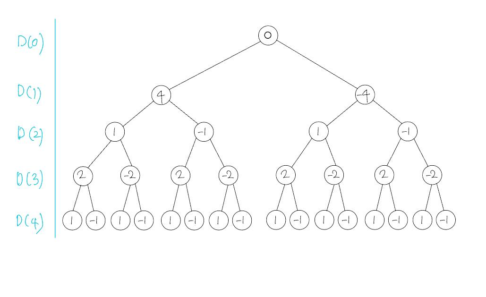
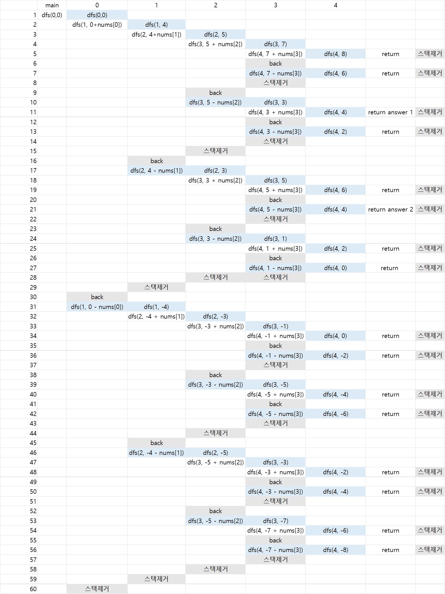

# DFS - 타켓넘버

1. 경우의 수 계산
   - 최악의 경우에 수행할 연산 횟수를 계산해서 재귀함수/완전탐색을 사용해도 될지 확인
     - 숫자 1개를 더하거나 뺄 수 있는 경우 2개
     - 숫자가 n개 있다면 2^n 경우의 수가 나온다.
     - 제한사항으로, 주어지는 숫자의 개수는 2개 이상 20개 이하입니다.
     - 2^20이 최악의 경우의 수로 약100만번의 경우의 수가 나온다. 
     - 500만번 이하이므로, 충분히 재귀함수를 통해서 완탐을 해도 시간복잡도에는 문제가 없겠다. 짚고 넘어갈 수 있다.

2. 수행동작
   - 재귀함수가 호출되었을 때 한 턴마다 수행할 동작 구현
     - 다음 숫자에 덧셈과 뺄셈을 계산하기 위해 호출 레벨(depth or index) 증가
     - depth 증가시키고, 누적합 + 현재레벨 합산해서 parameter로 넘겨 다음 dfs 호출

3. 탈출조건
   - 어느 시점에서 이 재귀함수를 탈출할지 구현

## 해설
- 해당 문제는 DFS로 풀 수 있다. 
1. 처음에 올 수 있는 문자는 +, - 2가지 경우가 올 수 있다. 
2. \+ 선택했다고 가정하면 그 다음 또한 +, - 2가지 경우로 올 수 있다.
3. \+  경우의 수를 먼저 탐색 한 다음, 재귀함수 백트랙킹으로 - 경우의 수를 계산한다.
4. 이렇게 하면 모든 경우의 수를 탐색해서 target이 되는 값을 찾을 수 있다.

 

