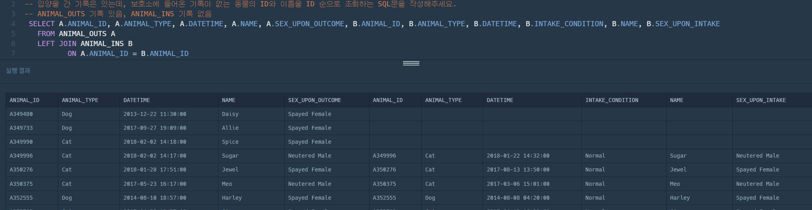

# 프로그래머스 SQL 고득점 kit
- 총 74문제
- 문제 풀면서 개념 정리 하기
- 시간 안에 푸는 연습 하기. 
- 정답 먼저 구현해놓고 나서 시간이 나면 코드 정렬 또는 간격 맞추기.
- 문제에서 알아야 하는 내용, 패스해도 되는 내용 구분하기

# MySQL
## REGEXP - 정규식을 이용한 검색
- Like '% %' 검색과 달리 조금 더 다양한 검색을 할 수 있도록 도움을 준다.

> select * from test where name regexp '가|나|다|라';
- select * from test where name like '%가%' or name like '%나%' or name like '%다%' or name like '%라%'; (동일 쿼리)

> select * from test where name regexp '[가-힇]';
- name 필드에 한글이 포함된 모든 레코드를 검색한다.

> select * from test where name regexp '^[가-힇]+$';
- name 필드에 한글로만 구성된 모든 레코드를 검색한다.

### REGEXP 정규식 기호 간단 소개 
- \. : 문자 하나를 나타낸다.
- \* : 앞에 나온 문자의 0개 이상 반복을 나타낸다.
- \^ : 문자열의 처음을 나타낸다.
- \$ : 문자열의 끝을 나타낸다.
- \[.] : 괄호 안의 문자열 일치를 확인한다.
- \{.} : 반복을 나타낸다.
- \| : or 를 나타낸다.

### REGEXP 참고사항
- 사용자에게 정규식 기능을 제공해선 안된다.
- 각 종 오류 포함할 수 있고, sql 인젝션에 취약해지기 때문에 개발자가 미리 정한 테두리 안에 행해져야 한다.

## ORDER BY COUNT(*) DESC LIMIT 1
> SELECT MEMBER_ID FROM REST_REVIEW GROUP BY MEMBER_ID ORDER BY COUNT(*) DESC LIMIT 1;
- SELECT 절에서 SEQ만 보이고 그룹화한 SEQ의 개수의 내림차순으로 해야할 때 위의 쿼리로 작성해야한다.
- LIMIT n은 리턴할 행의 제한된 수(n)를 지정합니다.
- 위에서 count로 집계된 최대 개수가 여러개인 경우 최대 개수 중 아무거나 한개가 반환된다. 

## JOIN
- SQL 조인 시각화 도우미 
- https://sql-joins.leopard.in.ua/

### LEFT JOIN
```
SELECT * 
  FROM TableA A
  LEFT JOIN TableB B 
         ON A.key = B.key
```
- 조인문의 왼쪽 테이블(A)의 모든 결과를 가져온 후 오른쪽 테이블(B)의 데이터를 매칭하고, 
- 매칭되는 데이터가 없는 경우 B항목들의 데이터를 NULL로 표시한다.
- `Level 3 없어진 기록 찾기` 문제 중 발취
  
  - left join 할떄 a 테이블과 b 테이블의 일치하는 데이터가 없는 경우
  - a 테이블의 데이터, b 테이블의 데이터가 어떻게 조회되는 지 정확히 몰랐음.
  - 공통되는 key를 기준으로 a 테이블의 데이터가 null로 나올 꺼라 생각했음. 
  - a 테이블과 b 테이블의 공통되는 key을 기준으로 둘 테이블의 모든 항목을 가져오는데,
  - a 테이블에 매칭되는 데이터가 없으면 b 테이블에서 공통되는 key 포함해서 모든 항목들이 null로 표시된다.
  - 단, a 테이블의 전체 데이터는 조회됨.